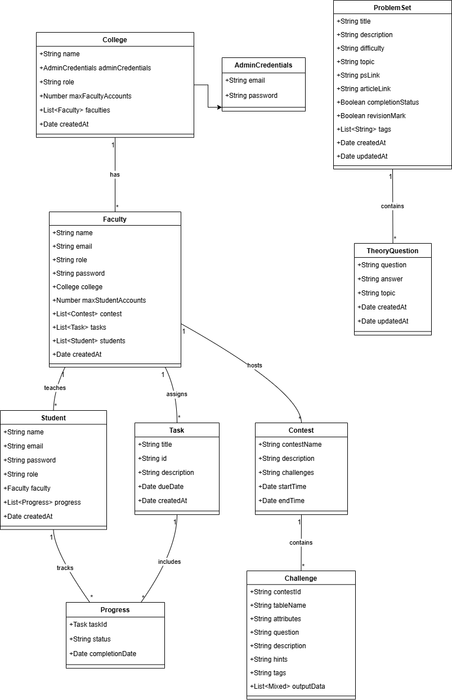

# **SQL Learning Platform**

Start by cloning the repository to your local machine:

- git clone <repository-url>
- cd backend
- npm install
> make sure to change the DB connection string for mongodb and username password for MYSQL
- npm run dev
- cd frontend
- npm install
- npm run dev

demo for frountend https://verbose-spork-r99rvp9rg9wcxr96-5173.app.github.dev/

The backend for horizontal scaling is running on three Engenius servers to support the system.

## Introduction
The SQL Learning Platform is an interactive educational tool designed to help students master SQL through assignments, contests, labs, and practice environments, with role-based access for colleges, faculty, and students. It also features AI-powered assistance like query optimization, natural language to SQL conversion, and interview preparation with mock interview , offering a comprehensive path to SQL proficiency.

## Problem Statement
- **Lack of Structured SQL Learning Resources**:
- **Limited Practical Environment for SQL Execution**:
- **Inadequate Focus on Real-World Application and Interview Preparation**: 

## Solutions

### Role-Based Access Management
Colleges, faculty, and students access the platform with defined permissions, allowing organized distribution of learning materials and streamlined student progress tracking.

### Structured Learning Modules
Faculty assign step-by-step SQL learning materials and assignments, helping students build SQL skills through guided practice.

### Interactive SQL Lab & Playground
A hands-on environment where students can practice queries, work on assignments, and access a playground for independent SQL exploration.

### AI-Powered Assistance
- **NLP-to-SQL**: Converts natural language descriptions into SQL queries for easier understanding.
- **Query Optimization Bots**: Provides Optimiza on SQL queries to optimize performance while boosting learning also.
- **Doubt clearing Chatbot**: Helps students with SQL-related questions and provides instant support.

### Peer Discussion  
- **Peer Discussion Forum**: Enables collaborative learning among students.
### Interview Prep
- **Interview Practice Sessions & Capstone Projects**: Allows students to apply SQL skills in real-world scenarios through projects and interview simulations.
- **top 50 SQL cheetsheet

### End-to-End Capstone Project Support
A guided project workflow, from requirements to ER diagrams, OOP fundamentals, and mock interviews, prepares students for practical SQL implementation in the real world.

---
AI chatbot
  NLP2SQL
  Doubt clarification Bot
  Optimization Bot
  the above 3 models builded by taking the gemini1.5 as a basemodel and then using python crewAI library we builded a agent for the respective bots
  NLP2ER model this model builded with Google AI studio we finetuned this model with a curated dataset made by our own

## NPM packages used
- **`@emotion/react`**: ^11.13.3 - A library for writing CSS styles with JavaScript using Emotion.
- **`@emotion/styled`**: ^11.13.0 - Styled component library built with Emotion for writing component-level styles.
- **`@mui/icons-material`**: ^6.1.6 - Material UI icons for React.
- **`@mui/material`**: ^6.1.6 - Material UI components for building user interfaces.
- **`alasql`**: ^4.5.2 - A JavaScript library to run SQL queries in the browser.
- **`react-table`**: ^7.8.0 - A lightweight and fast library for building tables in React.
- **`react-toastify`**: ^10.0.6 - A library for displaying toast notifications in React applications.
- **`styled-components`**: ^6.1.13 - A library for styling React components using tagged template literals.
- **`toastify`**: ^2.0.1 - A simple, lightweight toast notification library for React.

